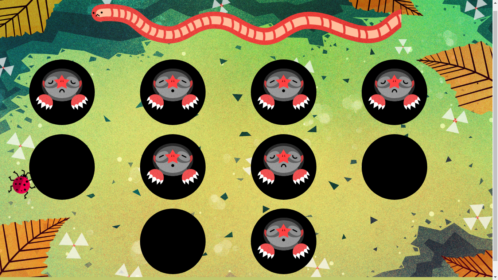

# Web Mole Game

Mole game with HTML, CSS, JavaScript. (Web-based)

## Description of Game

This is a hard project but you can do it! I'd recommend taking it in steps rather than trying to do everything at once. Some sort of progression. I'd recommend something like:

- Get all the **CSS** and **HTML** on the page. Have ten holes with a hungry mole in each. No JS done yet.
- Make the moles show up and disappear (don't worry about the sad face / butt yet.) Don't make them clickable yet, just have them disappear and reappear after a random interval.
- Make the hungry moles clickable. If you click on one, add 1 point to your score.
- After 10 clicks, show the win screen.
- Show the worm meter. As a player clicks on moles, show more and more of the worm.
- Make one in ten of the moles that show up a royal mole. If a user clicks a royal mole, add 2 points to their score.
- If a user doesn't click a mole in time, show a sad mole.
- If a user does click a mole in time, show a fed mole.
- After both sad and fed moles, show a mole butt.
- You're done!

## Idea of project

**Exercise:** Feed-A-Star-Mole

Here's your next project, a fun variant on the game Whack-A-Mole. If you're not familiar with the premise, the idea is that little moles will pop out of holes and the game is to tap them before they go back in their holes. In our variant, they're hungry little star moles and we're going to feed them worms! After a user gets 10 points, they win the game! There are also more-rare royal star moles that are worth double. If a user doesn't click on a mole in time, the mole frowns and heads back in its hole. If you manage to feed it in time, it smiles happily and disappers back into its hole.

We even have beautiful artwork for you to use, drawn by the talented **Alice Brereton**.

---------

# Max Base

My nickname is Max, Programming language developer, Full-stack programmer. I love computer scientists, researchers, and compilers. ([Max Base](https://maxbase.org/))

## Asrez Team

A team includes some programmer, developer, designer, researcher(s) especially Max Base.

[Asrez Team](https://www.asrez.com/)
